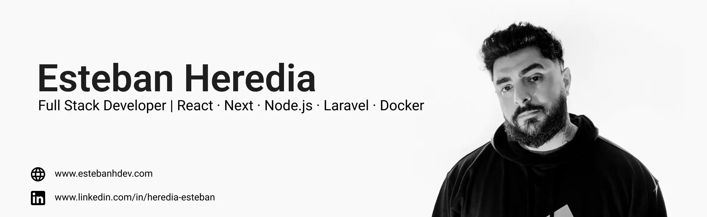

## 👋 Hola, soy Esteban Heredia  

💻 Desarrollador Fullstack | 🚀 Next.js & React | 🎨 Diseño UI/UX  

- 🌱 Actualmente aprendiendo: **Flutter - DevOps**  
- 🧰 Stack favorito: `React Vite`, `Next.js`, `Node.js`, `TailwindCSS`  
- 📸 También hago **fotografía y video**
- 📄 Si te interesa ve mi [CV](https://estebanhdev.com/api/uploads/1756263500394.pdf) para detalles sobre mi.

---

### 🛠 &nbsp;Tech Stack

&nbsp;
&nbsp;
&nbsp;
&nbsp;
&nbsp;
&nbsp;
&nbsp;
&nbsp;
&nbsp;
&nbsp;
&nbsp;
&nbsp;
&nbsp;
&nbsp;
&nbsp;
&nbsp;
&nbsp;
&nbsp;
&nbsp;
&nbsp;
&nbsp;

---

### 🗃 &nbsp;Databases

&nbsp;
&nbsp;
&nbsp;
&nbsp;

---

### 🧰 &nbsp;Version Control & Tools 

&nbsp;
&nbsp;
&nbsp;
&nbsp;
&nbsp;
&nbsp;
&nbsp;
&nbsp;
&nbsp;
&nbsp;
&nbsp;
&nbsp;
&nbsp;
&nbsp;
&nbsp;
&nbsp;
&nbsp;

---

### 🌐 Conectemos
- [Instagram](https://instagram.com/esteban_ink)  
- [LinkedIn](https://linkedin.com/in/heredia-esteban)  
- [Portafolio](https://estebanhdev.com)  
